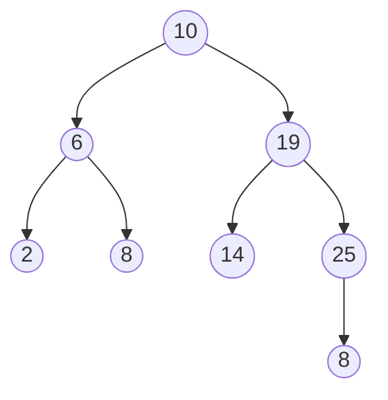
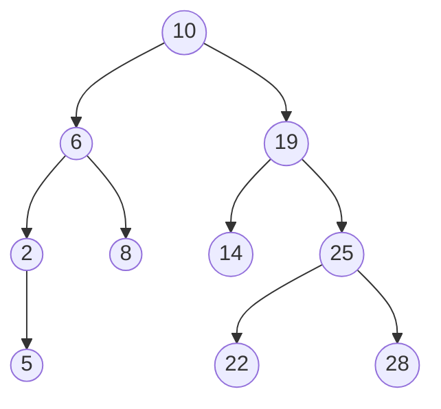

>[!info] Intro
>Les arbres binaires de recherche peuvent permettent d'implémenter les structures de données <u>ensemble</u> et dictionnaire

>[!summary] Sommaire
>[[Chapitre 16 - Arbres binaires de recherche#I)<u>Arbre binaire de recherche </u>| I)Arbre binaire de recherche]]
>[[Chapitre 16 - Arbres binaires de recherche#II)<u>Implémentation du type ensemble </u>|II)Implémentation du type ensemble]]

# I)<u>Arbre binaire de recherche </u>

>[!important] <u>Définition</u> :
>La structure abstraite d'ensemble permet de stocker des éléments unique avec pour opération de base :
>- créer un ensemble vide	
> - ajouter un élément (distincts de ceux déjà présents)
>  - supprimer un élément présent 
>  - rechercher un élément (test la présence)

>[!info] Compléments
>Avec un arbre binaire quelconque, ces opérations sont, respectivement, en :
> - création -> O(1)
> - ajout -> O(1) dans tous les cas si on ajoute comme racine. (problème: création arbre peigne)
> -  - -> O(k) dans le pire cas si on ajoute à une feuille ou à un nœud n'ayant qu'un fils.
> - suppression -> O(n) car il faut aller voir tous les nœuds.
> - recherche O(n) -> Idem


> [!summary] <u>ajout</u>
>	Méthode 1:
>	création d'un nouveau nœud et raccrochement
>	Méthode 2:
>		si on fait un parcours en largeur jusqu'au 1er nœud qui a strictement moins de 2 fils
>		-> complexité O(n) on doit peut être atteindre tous les nœuds sauf derniers de l'avant dernier niveau
>	Méthode 3:
>		descendre, p.esc, toujours à gauche
>		-> compléxite O(h)

<u>Définition</u> : ABR
	Si E est un ensemble totalement ordonnée d'étiquettes, on appelle arbre binaire de recherche étiqueté par E un arbre qui est :
		- soit vide
		- soit de la forme N(x,g,d) avec :
			 1. g et d des ABR 
			 2. pour toute étiquette $x_{g}$ dans g : $x_{g} <x$ 
			 3. pour toutes étiquette $x_{d}$ dans d : $x_{d}<d$

$$\begin{align}
E&=\mathbb{N} \text{ par exemple }\\
&= \mathbb{R}\\
&= \text{ensemble des chînes de caractères (ordre lexicographique)} \\
&= \text{couples de flottants} \text{ (2,3) < (3,2)   et (2,3) < (2,4)}
\end{align}$$

    

<u>Propriéteé (caractéristique)</u> :
	Un arbre binaire est un ABR 
	<u>ssi</u> la liste de ses étiquettes dans l'ordre **infixe** est croissante*

<u>*remarque</u> : strictement croissante puisque l'on a supposé toute les étiquettes distinctes

<u>Démonstration</u> :
	- <u>sens direct</u> : On va montrer <u>par induction</u> sur la structure d'arbre bianire que 
		$\mathscr{P}_{a}$ ``pour tout ABR, a, la liste de ses étiquettes dans l'ordre issu d'un parcours infixe est croissante``
		- <u>si a est vide </u>: (cas de base / initialisation):
			Une liste vide est croissante (cf il s'agit d'une propriété qui être vraie pour out couple $(x_{i},x_{j})$ de la liste : si $i<j \text{ alors } x_{i}<x_{j}$)
			Donc $\mathbb{P}_{a}$ est vraie pour $a$ vide
		- <u> si a = N(x,g,d)</u> : Si on suppose que g et d vérifient $\mathscr{P}$ 
			Le parcours infixe de $a$ revoie la liste $L_{g}@[x]@L_{d}$ 
			Par hypothèse d'induction : $L_{g}$ est croissante
								   $L_{d}$ est croissante
			Parce que $a$ est un ABR tout élément $x_{g}$ de $L_{g}$ est $<x$ 
										   $x_{d}$ de $L_{d}$ est $>x$
			<u>Donc</u> la liste $L_{g}@[x]@L_{d}$ est croissante

>[!note] <u>N.B</u> : 
>	tout les éléments de la définition des ABR ont servi.

<u>Démonstration</u> :
	- <u>sens indirect</u> : On va montrer <u>par induction</u> sur la structure d'arbre binaires que 
		$\mathscr{P}_{a}$ ``Si pour un arbre binaire a, la liste de ses étiquettes dans l'ordre issu d'un parcours infixe est strictement croissante alosr a est un ABR``
		- <u>si a est vide </u>: (cas de base / initialisation):
			a est un ABR de par le définition des ABR.
			Donc $\mathbb{P}_{a}$ est vraie pour $a$ vide.
		- <u> si a = N(x,g,d)</u> : Si on suppose que $\mathscr{P}$ est vraie pour g et d   
			<u>si</u> la liste des étiquettes issue d'un parcours infixe de g est strictement croissante alors g est un ABR.
			et si la liste des étiquettes issue d'un parcours infixe de d est strictement croissante alors d est un ABR.
			Considérons un arbre binaire non vide $a=N(x,g,d)$ tel que :
				la liste $L$ de ses étiquettes dans un parcours infixe est strictement croissante.
			alors (propriété du parcours infixe) $L=L_{g}@[x]@L_{d}$ 
				par hypothèse $L$ croissante strictement donc :
					1. $L_{g}$ croissante strictement donc (hypothèse d'induction) ==g est un ABR== 
					2. $L_{d}$ croissante strictement donc (hypothèse d'induction) ==d est un ABR== 
					3. $x>x_{g}$ pour tout élément de $L_{g}$
					   $x < x_{d}$ pour tout élément de $L_{d}$
		<u>Conclusion</u> : En vertu de 1, 2 et 3 et de la définition d'ABR, $a$ est un ABR

<u>Remarque</u> : résumé sens indirect 
	faire un schéma ! 

# II)<u>Implémentation du type ensemble </u>

## 1. <u>Recherche</u> : 

>[!info] Info
>$a \text{ est supposé ABR}$

>[!note] Implémentation :
>```OCaml
>let rec recherche e a = match a with
>	|Vide -> false
>	|N(x,g,d) -> if x = e then true
>				else if x < e then recherche e g
>						else recherche e d
>```

#### ✦<u>Terminaison</u> : 
on a pour <u>variant d'appel</u> la taille de l'arbre si la recherche se poursuit, elle se poursuit dans un sous-arbre gauche ou droit qui est de taille strictement plus petite (ne contient pas la racine)
->donc la fonction termine

#### ✦<u>Correction</u> :
invariant de boucle:
	recherche e a renvoie true ssi e est une étiquette d'un nœud de a.
On procède par induction sur la structure d'arbre binaire 
	- <u>si a est vide</u> : vrai recherche e arbre vide renvoie ``false`` (voir code)
				 et $e \not\in a$ car a est vide 
				l'équivalence est vraie
	- <u>si a = N(x,g,d)</u> :
		si $x=e$ : l'appel renvoie true (cf code)
		si $e<x$ : on effectue l'appel ``recherche e g`` qui renvoie ``true`` ou ``false`` selon $e\in a$ à g ou pas (hypothèse d'induction)
		si $x<e$ : on effectue l'appel ``recherche e g`` qui renvoie ``true`` ou ``false`` selon $e\in a$ à d ou pas (hypothèse d'induction)
<u>Conclusion</u> : Vrai pour vide et vrai par induction pou N(x,g,d) (arbre non vide) donc vrai pour tout autre arbre
#### ✦<u>Complexité</u> : 
Si on note C(h) la complexité pour un arbre de hauteur h, alors on a 
	$C(0)=1$
	$C(h)\leq C(h-1)+1$
	$$C_{a} = \begin{cases}
	O(1) \text{ -> cas numero 1 : on trouve la valeur à la racine} \\
 O(1) + C_{g} \text{ -> cas numero 2 : on cherche la valeur dans le sous-arbre gauche}\\
O(1) + c_{d} \text{ -> cas numero 3 : on cherche la valeur dans le sous-arbre droit}  
 & \end{cases}$$
$C_{a}\leq max(O(1),O(1)+C_{g},O(1)+C_{d})$
$C(h)\leq O(1) + O(h-1) \text{ h-1 majore la hauteur du sous arbre gauche ou droit}$

## 2. <u>Ajout d'un élément </u> : 


>[!example] Ex
>- ajouter 5 (chercher 5 dans l'arbre et lorsque l'on arrive sur un arbre vide)
>- ajouter 14 (idem mais on trouve la valeur donc on n'ajoutera pas car on a proscrit les doublons)
>- ajouter 22

>[!info] Implémentation en OCaml
>```OCaml
let rec ajout a e = match a with
>	|Vide -> N(e, Vide, Vide)  (*ce que l'on fait si on ajoute a un arbre                                          vide*)
>	|N(x,g,d) -> if x = e then a (*on pourrait aussi lever une exeption avec                                        failwith *)
>				else if e < x then N(x, ajout g e, d)
>				else N(x, g, ajout d e)
>```

>[!note] N.B 
>les instructions de la forme `N(x,g,d)` sont les arbres qui vont être renvoyer (en supposant que les appels récursifs font leur travail)
#### ✦<u>Terminaison</u> : 

>[!info] Variant d'appel :
>la taille de l'arbre ou la hauteur (diminue de 1 au moins à chaque appel récursif)

### ✦<u>Correction partielle</u> : 

>[!note] Correction
>On va montrer que 
>$\mathscr{P}$ : l'appel `ajout a e` renvoie un ABR contenant les mêmes valeurs que a et la valeur e si elle n'est pas dans a.
><u>Démonstration </u> :
>
>- si a est vide : 
> ajout a e renvoie N(e, Vide, Vide)
> $N(e, Vide, Vide)$ est un ABR d'après la définition des ABR (et pour tout x dans g = Vide x<e idem à droite)
>- si a est non vide, i.e. si $a = N(x,g,d)$ : disjonction de cas
><u>cas n°1</u> : $e = x$ : a est un ABR et e appartient à a donc $\mathscr{P}$ vraie
><u>cas n°2</u> : $a = N(x,g,d)$ et $e < x$ 
>  On veut veut montrer que ajout a e vérifie $\mathscr{P}$ c.à.d. que ajout a e 1: `est un ABR` et 2: `contient les mêmes valeurs que a + événtuellement e`
>  Or l'appel ajout a e revoie : `a' = N(x, ajout g e, d) = N(x, g', d')`
>  
>  1 : 
>  $g' = ajout g e$ est un ABR par hypothèse d'induction.
>  $d' = d$ est un ABR (car a ABR)
>  Toutes les valeurs dans g' sont $< x$ car ces valeurs sont dans g (et a ABR [avec x à la racine]) ou valent e (et $e < x$)
>  Toutes les valeurs dans d' sont $> x$ car a ABR [avec x à la racine]
>  
>  2 :
>  oui car contient x et les valeurs d et par hypothèse d'induction les valeurs dans ajout g e sont celles de g plus éventuellement e si $e \not\in g$ 
> - <u>cas n°3</u> :$a  = N(x,g,d)$ et  $e > x$.
>Même démonstration que le cas n°2 en remplaçant $e < x$ par $e > x$ et en échangeant les rôles de g et d

>[!info] <u>Remarque sur la méthode d'ajout</u> :
>Qu'obtient on si on ajoute à un arbre vide, successivement 1,2,3,4,5 ?
>```mermaid
>graph TD
>id1((1)) --> id2((2)) --> id3((3)) --> id4((4)) --> id((5))
>```
>On obtient un arbre peigne à droite dans laquelle la recherche est en $O(n)$ (si on ajoute n valeurs, données dans l'ordre croissant).

>[!tip] <u>Rappel</u> :
>la recherche dans un ABR:
>  suivant la façon dont est construit l'arbre. La complexité est en $O(n)$ (arbre peigne ou "chaîne")
>  ou en $O(\log_{2}(n))$ (arbre binaire parfait [|2 fils sauf feuilles // toutes les feuilles à la même profondeur], arbre binaire complet [tous les niveaux de profondeur sont complètements remplis sauf éventuellement le dernier où toutes les feuilles sont tassés à gauche])

>[!info]
>Pour éviter ce défaut, o,=n cherche à <u>équilibrer</u> les arbres et à préserver cet équilibre lors des ajouts
>Un arbre est équilibré si la taille du fils gauche et du fils droit diffèrent au plus de 1.

## 3. <u>Suppression d'un élément</u> :

>[!question] Que faire si on veut supprimer le 10 ?
>``` mermaid
>graph TD
>id1((10)) --> id2((6))
>id1((10)) --> id3((19))
>id2((6)) --> id4((2))
>id2((6)) --> id5((8))
>id3((19)) --> id6((14))
>id3((19)) --> id7((25))
>id7((25)) --> id8((28))
>```

>[!success] <u>Proposition d'algorithme</u> : pour supprimer la valeur à la racine
>Si le sous-arbre gauche n'est pas vide :
>1. Chercher la valeur la plus grande dans le sous-arbre gauche. (recherche de max)
>2. Remplacer la valeur à la racine par ce maximum.
>3. Supprimer le nœud contenant le maximum
>```mermaid
>graph TD
>id1((8)) --> id2((6))
>id1((8)) --> id3((19))
>id2((6)) --> id4((2))
>id3((19)) --> id6((14))
>id3((19)) --> id7((25))
>id7((25)) --> id8((28))
>```
>- <u>sinon</u> : on renvoie le sous arbre droit
>>[!tip] <u>Remarque</u> :
>>On pourrait aussi chercher la plus petite valeur du sous-arbre droit et la mettre à la racine

>[!caution] <u>Correction de l'algorithme</u> : 
> - obtient on un ABR ?
> - les valeurs dans l'arbre sont-elles les mêmes, sauf la valeur à la racine supprimée

>[!note] <u>Éléments de preuve</u> :
>- <u>supposons le sous-arbre gauche non vide</u> :
> 1. Si on remplace l'étiquette `r` de la racine par le maximum `M` de sous-arbre gauche, en supprimant le nœud qui le contient : a-t-on toujours un ABR
> L'arbre avec sa racine était un ABR, et le maximum était dans le sous-arbre gauche donc : $M < r$ et M est le maximum de g, donc : $\forall x$ dans g, $x\leq M$  ( < car toutes les valeurs sont distinctes) donc dans g' (g privé de M) on a : $\forall x \in g', x<M$ et  dans d, on a toujours $\forall x_{d} \in d, x_{d}>r>M$

>[!info] <u>Reste à faire</u> : prouver que le maximum est nécessairement dans une feuille

>[!note] <u>Suppression du min à gauche</u> :
>``` OCaml
>let rec supprime_min a  = match a with
>	|Vide -> Failwith"Arbre vide"
>	|N(x,Vide,d) -> x, d
>	|N(x,g,d) -> let m, g1 = supprime_min g 
>				in m, N(x,g1,d)
>```
>>[!info] Complément
>>Supprime_min a prend en argument un arbre dont on veut supprimer le min.
>> - cet arbre doit être non vide
>> - si $a = N(x,Vide,d)$ alors $x$ est le min et on renvoie $x$ (min) et $d$ ($a$ privé de son min)
>> - si $e = N(x,g,d)$ alors le min est dans $g$ et on le cherche récursivement `supprime_min g` renvoie le min $m$ et $g_{1}=g$ privé de son min
>``` OCaml
>let rec supprime a e = match a with
>	|Vide -> vide
>	|N(x,g,d) when x=e -> let m,d1 = supprime_min d
>								in N(m,g,d1)
>	|N(x,g,d) when e<x -> N(x,supprime g e,d)
>	|N(x,g,d) -> N(x,g,supprime d e)
>```
>>[!example] <u>Complexité</u> : $O(h)$
>>>[!tip] Démonstration :
>>> 1. complexité de `supprime_min` -> $O(h) \text{ ou } O(1) + C(d)$
>>> 2. complexité de `supprime` -> $C(a) = O(1) + C(g) \text{ ou } O(1) + C(d)$
>>> 
>>> 
>>> $C(a) = \begin{cases}(1) \\ (2) \\ (3) \end{cases}$
>>> <u>Par induction</u> : $C(a) = C(h_{a})$
>>> - sur un arbre ivde $C(v) = O(1)$
>>> - si $C(g) = O(h_{g})$ et $C(d)=O(h_{d})$ par $(1) \text{, }(2) \text{ et }(3)$ 
>>>  $$C(a) \leq \alpha\times 1 + \beta \times \max(h_{g},h_{d}) \leq \max(\alpha,\beta) \times \max(1+h_{g}, 1+h_{d})$$
>>>  $$C(a) \leq O(1) + O(h_{d}) \text{ ou } O(h_{g}) $$

>[!attention] <u>Notation</u> :
>lorsque l'on écrit : `|N(x,g,d) when x= e -> ...` on appelle <u>motif gardé</u> la partie `when x = e`
