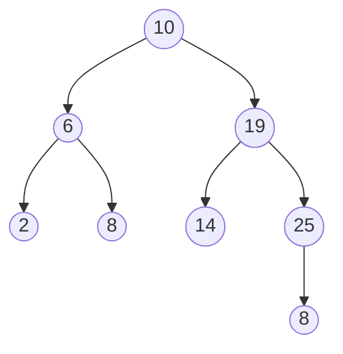

Les arbres binaires de recherche peuvent permettre d'implémenter les structures de <mark style="background: #FF5582A6;">données</mark> et dictionnaire 

## I \ ABR

<mark style="background: #00688F;"><u>Définition</u></mark> : La structure abstraites d'ensemble permet de stocker des éléments <mark style="background: #FF5582A6;">unique</mark> avec peu d'opération de base :
- Créer des ensemble vide 
- ajouter un élément (distincts de ceux déjà présent)
- supprimer un élément présnet 
- rechercher un élément (tester la présence)

Avec un arbre binaire quelconque, ces opérations sont respectivement, en :
- Création : O(1)
- Supression O(n) car il faut aller voir tous les noeuds

- Ajout :
  - <mark style="background: #BBFABBA6;">Methode 1</mark> :
    - O(1) dans tous les cas si on ajoute comme racine (création d'un nouveau noeud et raccordement)
    - O(h) dans le pire cas si on ajoute à une feuille à un noeud n'ayant qu'un fils.
	- <mark style="background: #BBFABBA6;">Méthode 2</mark> : 
	  - Si on fait un parcours en largeur jusqu'au 1er noeud  srtictement negatif  de 2 fils : Complexité en O(n)


Les ABR arbres de recherche permettent d'assurer de meilleurs complexité (*cf* : rech. dicho. dans un tableau trié versus recherche sequentielle). 

<mark style="background: #00688F;"><u>Définition</u></mark> : ABR 
	Si E est un ensemble totalement ordonné d'étiquette, on appelle arbre binaire de recherche étiqueté par E un arbre qui est :
		- soit vide 
		- soit de la forme $N(x,g,d)$ avec : 
			1) $g$ et $d$ des ABR 
			2) pour toute étiquette $x_g$ dans $g : x_g<x$
			3) pour toute étiquette $x_d$ dans $d : x_d<x$

$$\begin{align}
E &= \mathbb{N} \ \text{par exemple}\\
&=R\\
&=ensemble\\ 
&= \text{couples de flottants} \text{ (2,3) < (3,2)   et (2,3) < (2,4)}
\end{align}$$


$8<10$ ce n'est pas un ABR 


<mark style="background: #00688F;"><u>Propriété (caractéristique)</u></mark> : 
	Un arbre binaire est un ABR 
	<u>ssi</u> la liste de ses étiquettes dans l'ordre infixe est croissante
	
<u>remarque</u> strictement croissante puisque l'on a supposé toute les étiquettes distinctes

>[!summary]+  Démonstration : 
>- <u>sens direct</u> : On va montrer, par induction sur la structure d'ABR que pour tout ABR $a$, la liste de ses étiquettes dans l'ordre issu d'un parcours infixe est croissante --> $\mathscr{P}_a$
>	- si $a$ est vide : (cas de base / initialisation)
>		- une liste est croissante (*cf* il s'agit d'une prpriété qui doit être vraie pour tout couple $(x_i,x_j)$ de la liste : si $i<j$ alors $x_i<x_j$)
>		>
>	- si $a=N(x,g,d)$ : Si on suppose que g et d vérifient $\mathscr{P}$
>		- Le parcours infixe de a renvoie la liste $L_g@[x]@L_d$
>		- Par hypothèse d'induction : $L_{g}\nearrow$
>		- Par hypothèse d'induction : $L_{d}\nearrow$
>		- parce que a est un ABR tout élément $x_g$ de $L_g$ est $<x$
>		- parce que a est un ABR tout élément $x_g$ de $L_g$ est $<x$
>		- Donc la liste $L_g@[x]@L_d$ est croissante 


>[!summary]+ Démonstration : 
>- <u>sens indirect</u> : On va montrer, par induction sur la structure d'arbre binaire que si par un arbre binaire $a$, la liste de ses étiquettes dans l'ordre issu d'un parcours infixe est strictement croissante alors a est un ABR --> $\mathscr{P}_a$
>	- si $a$ est vide : (a est un arbre binaire vide)
>		- a est un ABR de par la définition des ABR 
>		>
>	- si $a=N(x,g,d)$ : on suppose que $\mathscr{P}$ est vraie pour$g$ et $d$
>		- si la liste des étiquettes issue d'un parcours infixe de $g$ est strictement croissante alors $g$ est un ABR 
>		- et si la liste des étiquettes issue d'un parcours infixes de $d$ est strictement croissante alors $d$ est un ABR 
>		- Considérons un arbre binaire non vides $a=N(x,g,d)$ tel que :
>			- la liste $L$ de ses étiquettes dans un parcours infixe est strictement croissante 
>		- alors (propriété du parcours infixe) $L=L_g@[x]@L_d$
>			1) $L_g$ croissante strictement donc (hypo. d'induction) <mark style="background: #FF5582A6;">$g$ est un ABR</mark>
>			2) $L_d$ croissante strictement donc (hypo. d'induction) <mark style="background: #FF5582A6;">$g$ est un ABR</mark>
>			3) $x>x_g$ pour tout élément de $L_g$
>			4) $x>x_g$ pour tout élément de $L_g$
>- <u>Conclusion</u> : En vertu de 1,2,3 et 4 et de la definition d'ABR, $a$ est un ABR

## II \ Implémentations du type ensemble 

### 1) <u>Recherche</u> : a est supposé ABR 

   ```Ocaml
   let rec recherche e a = match a with 
	   |Vide -> false
	   |N(x,g,d) -> if x = e then true 
						else if e < x then recherche e g
						else recherche e d 
   ```
- <mark style="background: #00688F;"><u>Terminaison</u></mark> : on a pour variant d'appel la taille de l'arbre. 
  Si la recherche se poursuit dans un sous-arbre gauche ou droit qui est de taille strictement plus petite (ne contient pas la racine) donc la fonction termine

- <mark style="background: #00688F;"><u>Correction </u></mark> : invariant d'appel : recherche e a renvoie true ssi e est une etiquette d'un noeud de a .
  On procède par induction sur la structure d'arbre binaire 
	-  <u>si a est vide</u> :  vrai recherche e arbre vide renvoie ``false``
				    et e $\notin$ a car a est vide
				    l'équivalence est vraie
	- <u>si a = N(x,g,d)</u> : 
	  si x = e : l'appel renvoie 

- <mark style="background: #00688F;"><u>Complexité</u></mark> : $$\begin{align}
 &C(0)=1 \\
 &C(h)\leq C(h-1)+\left\lbrace{\begin{aligned}&1 \\ &O(1) \\ &\alpha.1
\end{aligned}}\right.\\
&C_a = \left\lbrace O(1) \rightarrow \text{Cas n°1 : on trouve la valeur à la racine} \right.
\end{align}$$


### 2) <u>Ajout d'un élément</u> : 

```Ocaml
let rec ajout a e = match a with 
	|Vide -> N(e,Vide,Vide) (*Ce que l'in fait si on ajoute e à un arbre vide*)
	|N(x,g,d)->if x=e then a (*On pourrai aussi lever une exception avec failwith*)
				else if e<x then N(x,ajout g e, d)
				else N(x,g,ajout d e)
				
```

- <mark style="background: #00688F;"><u>Terminaison</u></mark> : variant d'appel la taille de l'arbre de la hauteur (diminue de 1 au moins à chaque appel récursif)
  
- <mark style="background: #00688F;"><u>Correction partielle</u></mark> : On va montrer que l'appel ajout a e renvoie un ABR contenant les memes valeurs que a et la valeur e si elle n'est pas dans a.

>[!summary]+ Démonstartion
> - Initialisisation / cas de base $\star$ <u>si a est vide</u> :
>   `ajout a e` renvoie `N(e,Vide,Vide)`
>   `N(e,Vide,Vide)` est un ABR d'après la définition des ABR 
> 
>- Etape d'induction $\star$ <u>Si a est non vide</u> ie si `a = N(x,g,d)`
>  - <mark style="background: #BBFABBA6;"><u>Cas n°1</u></mark> : e=x :  a est un ABR et e appartient à a donc $\mathscr{P}$
>    >
>  - <mark style="background: #BBFABBA6;"><u>Cas n°2</u></mark> : `a = N(x,g,d)` 
>    - On veut montrer que ajout a e vérifie $\mathscr{P}$ càd que ajout a e :
> 	   1)  est un ABR 
> 	   2) Contient les mêmes valeurs a + eventuellemnt e
>    - Or l'appel ajout a e renvoie `a' = N(x,ajout g e,d` 
> 	   1) `g' = ajout g e` est un ABR par hypothèse d'induction
> 	   d' = d est un ABR (car a est un ABR)
> 	   Toutes les valeurs dans g' sont $<$ x car ces valeurs sont dans g (et  a ABR avec x à la racine) ou valent e (et $e < x$)
> 	   Toutes les valeurs dans d' sont $> x$ car a ABR (avec x à la racine)
> 	   
> 	   
> 	   A finir


##### Remarque sur la méthode d'ajout : 


<u>Rappel</u> : la recherche dans un ABR est en O(h) dans le pire cas, pour un arbre de hauteur h
Sui


<u>Supression du max à gauche</u> 

```Ocaml
let rec supprime_min a = match a with
	|Vide -> failwith "Arbre Vide"
	|N(x,Vide,d) -> x,d
	|N(x,g,d) -> let m,g1 = supprime_min g in m,N(x,g1,d)
```

`supprime_min a` prend en argument un arbre dont on veut supprimer le min.
- cet arbre doit être vide
- si `a = x` (x = Vide / d) alors x est le min et on renvoie x (max) et d (a privé de son max) 
- si `a = x` (x = g non vide / d ) alors le min est dans g et on le cherche récursivement

`suprime_min g` renvoie le min `m` et `g1 = g` privé de son min

```Ocaml
let rec supprime a e = match a with
	|Vide -> Vide 
	|N(x,g,d) when x = e (*motif gardé*)-> let m,d1 = supprime_min d in N(m,g,d1)
	|N(x,g,d) when e < x -> N(x, supprime g e, d)
	|N(x,g,d) -> N(x,g,supprime d e)
```

<u>Complexité O(h)</u> :

>[!summary] Démo
>1) Complexité de supprime_min. $O(h)$ ou $O(1)+C(d)$
>2) Complexité supprime. $C(a) = O(1)+C(g)$ ou $O(1)+C(d)$
>
>$$C(a) = \cases{
>\ O(1)+C(d) \ \ \ (1)\\
>\ O(1)+C(g) \ \ \ (2)\\
>\ O(1)+C(d) \ \ \ (3)
>}$$
><u>Par induction</u> $C(a)=O(h_a)$
>- Sur un arbre vide $C(v)=O(1)$
>- Si $C(g)=O(h_g)$ et $C(d)=O(h_d)$  par (1) ,(2), (3) 
> $$C(a) \leq \underbrace{\alpha \times 1}_{O(1)} + \underbrace{\beta \max(h_g,h_d)}_{O(h_d) \ \text{et} \ O(h_g)} \leq max(\alpha,\beta) \times \max(1+h_d, 1+h_g) 
> $$ 


