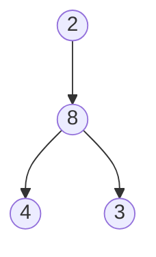

# <u>Exercice 5</u>

```Ocaml
type 'a arbre = Vide | Noeud of 'a * 'a arbre * 'a arbre.
```

### Question 1) 

```Ocaml
let rec prefixe a = match a with 
	|Vide -> []
	|Noeud (v,g,d) -> v::(prefixe g @ prefixe d)
```

### Question 2)

```OCaml
let rec infixe a = match a with
	|Vide -> []
	|Noeud (v,g,d) -> infixe g @ (v::infixe d)
```

### Question 3)

```OCaml
let rec suffixe a = match a with
	|Vide -> []
	|Noeud (v,g,d) -> suffixe g @ suffixe d @ [v]
```

# <u>Exercice 6</u>



#
---
#Informatique #TD 